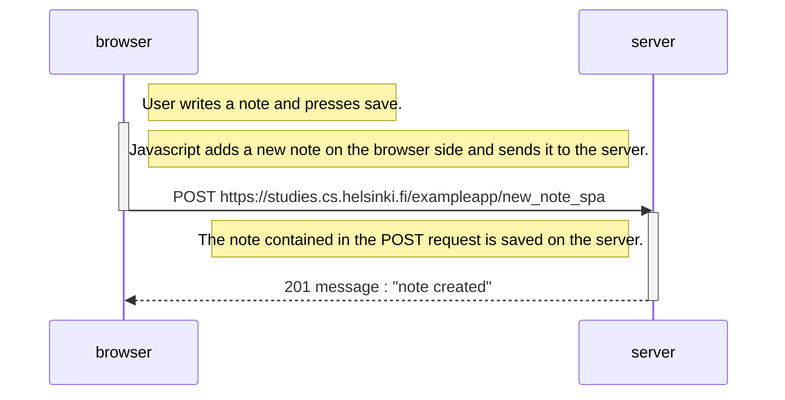

```mermaid
sequenceDiagram
    participant browser
    participant server

    note right of browser: User writes a note and presses save.
    activate browser
    note right of browser: Javascript adds a new note on the browser side and sends it to the server.
    browser->>server: POST https://studies.cs.helsinki.fi/exampleapp/new_note_spa
    deactivate browser
    activate server
    note left of server: The note contained in the POST request is saved on the server.
    server-->>browser: 201 message : "note created"
    deactivate server
    

```